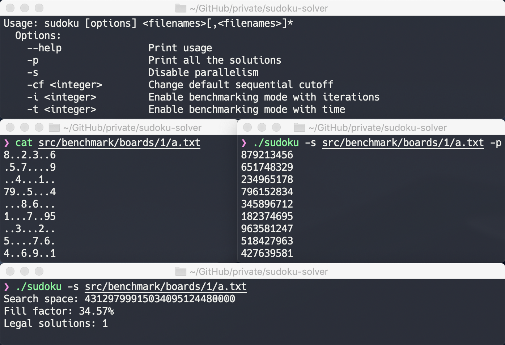
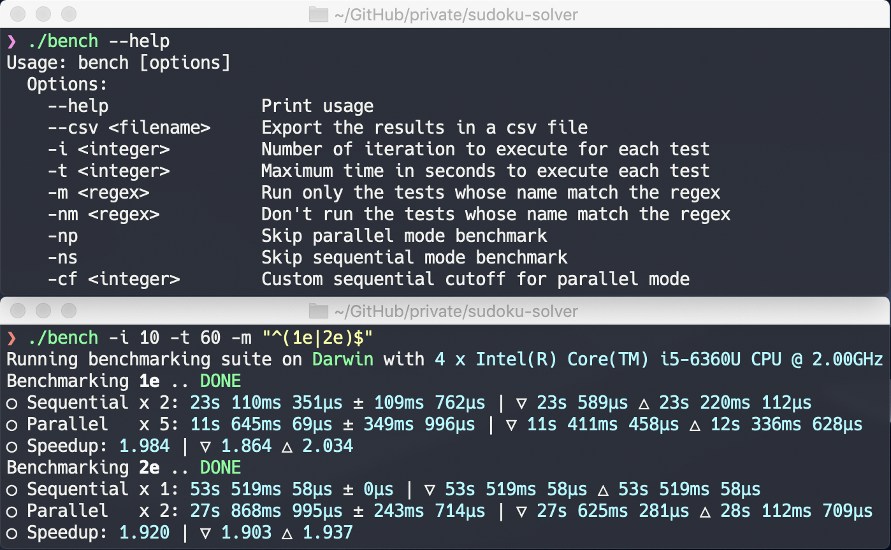

<h1 align="center">
  <b>sudoku-solver</b>
</h1>

<p align="center">
  🔢 Sudoku Solutions Enumerator (Sequential and Parallel)
  <br/>

  <sub>
    Coded by <a href="#authors">Simone Primarosa</a> and <a href="#authors">Q. Matteo Chen</a>.
  </sub>
</p>

## Introduction to Sudoku


Sudoku is a popular puzzle game usually played on a 9x9 board of numbers between
1 and 9.

The goal of the game is to fill the board with numbers. However, each row can
only contain one of each of the numbers between 1 and 9. Similarly, each column
and 3x3 sub-board can only contain one of each of the numbers between 1 and 9.
This makes for an engaging and challenging puzzle game.

A well-formed Sudoku puzzle is one that has a unique solution.
A Sudoku puzzle, more in general, can have more than one solution and our goal
is to enumerate them all, but this task is not always feasible.
Indeed, if we were given an empty Sudoku table, we would have to enumerate
[6670903752021072936960 solutions][ref:sudoku-board-num], and this would take
thousands of years.

### Definitions
In the following sections we will use some letters or words to refer to specific
aspects of the Sudoku problem. The following table summarizes the most important.

Term | Description
-----|------------
S | A perfect square indicating the number of columns, rows, and boxes of a Sudoku board.
N | The total number of cells of a board given as N = S * S.
B | The size of a single box of the matrix as B = √S
Board | An instance of Sudoku represented with a S x S matrix.
Row | A row of a board's matrix that can only contain one of each of the numbers in [1, S].
Column | A column of a board's matrix that can only contain one of each of the numbers in [1, S].
Box | A particular B x B sub-matrix of a board's matrix that can only contain one of each of the numbers in [1, S].
Cell | A single entry of a board's matrix either empty or with a legal assignment.
Empty Cell | A cell whose assignment has still to be found.
Cell's Candidates | A list of values in [1, S] which can be legally placed in a particular cell.
Search Space | The productory of the candidates of all the empty cells.
Solution | An assignment of values for all the empty cells of a board that satisfies the constraints.

## Solving Algorithm
A common algorithm to solve Sudoku boards is called
[backtracking][ref:backtracking]. This algorithm is essentially a
[depth-first search][ref:dfs] in the tree of all possible guesses in the empty
cells of the Sudoku board.

### Sequential Backtracking
The sequential algorithm, that can be found in
[`src/main/java/sudoku/SequentialSolver.java`][source:sequential], is
implemented iteratively and can be summarized by the following pseudo-code.

```python
def sequential_solutions_counter(board):
  stack = []

  if board.is_full(): return 1
  (row, col) = board.get_empty_cell()
  stack.push((row, col, EMPTY_CELL_VALUE))
  for val in board.get_candidates(row, col): stack.push((row, col, val))

  count = 0
  while len(stack) > 0:
    (row, col, val) = stack.pop()
    board.set_cell(row, col, val)
    if val == EMPTY_CELL_VALUE: continue

    if board.is_full(): count += 1; continue
    (row, col) = board.get_empty_cell()
    stack.push((row, col, 0))
    for val in board.get_candidates(row, col): stack.push((row, col, val))

  return count
```

It's important to notice that the strategy used to pick the empty cell by the
`get_empty_cell` can lead to [significant reduction][ref:look-ahead] of the
total search space and thus in the time needed to enumerate all the solutions.

Another notable thing to consider is that the time complexity and space
complexity of all the operations on the board inside the while loop
(`is_full`, `set_cell`, `get_empty_cell`, `get_candidates`)
can significantly impact the overall performance of the backtracking and thus
has to be kept as efficient as possible.

More details about the computational complexity of the operations and the idea
behind their implementation can be found in the
[implementation details](#implementation-details) section.

### Parallel Backtracking
The parallel algorithm, that can be found in
[`src/main/java/sudoku/ParallelSolver.java`][source:parallel], is
implemented by parallelizing the recursive guesses of each empty cell and can be
summarized by the following pseudo-code.

```python
def parallel_solutions_counter(board, move):
  if move is not null:
    (row, col, val) = move
    board = board.clone()
    board.set_cell(row, col, val)

  if board.is_full(): return 1

  space = board.get_search_space_size()
  if space == 0: return 0
  if space <= SEQUENTIAL_CUTOFF:
    return sequential_solutions_counter(board)

  count = 0
  (row, col) = board.get_empty_cell()
  parallel for val in board.get_candidates(row, col):
    count += parallel_solutions_counter(board, (row, col, val))

  return count
```

The same consideration given for the
[sequential backtracking](#sequential-backtracking) also holds for the parallel
version.
In addition to those, it's worth mentioning that two new methods have been
introduced (`get_search_space_size` and `clone`).

The presence of those new methods and the creation of a thread for each branch
of the backtracking are the major cause of overhead.
The sequential algorithm is indeed used as sub-routine to speedup the
computation, when the remaining search space is below a certain threshold
empirically found.

More details about the computational complexity of the operations and the idea
behind their implementation can be found in the
[implementation details](#implementation-details) section.

### Implementation details

#### Check if the board is completed in constant time
The naive approach is to loop through the whole board and check whether or
not there is an empty cell.

A better approach is to keep track of the number of the filled cells of the
board (also called clues) and compare it against the total number of cells of
the board.

The number of clues is initially set to `0` and gets increased or decreased
appropriately after each `set_cell` operation.

So, at the small cost of a constant additional work inside the `set_cell` and an
overall additional constant memory usage, we reduced the time complexity for the
`is_full` method from `O(N)` to `O(1)`.

#### Check if a value is legal for a cell in constant time
The naive approach is to iterate on the row, column, and box of the given
cell searching for the specific value not to be present in any of them.

But if we somehow keep track of the used values on each row, column, and box of
the board we can avoid looping through all the cells like the naive approach
does. To do so it's sufficient to keep a bit-set of `S` bits for each
row, column, and box.
Then each time a specific cell's value `v` is set, we also set the bit at
position `v - 1` of the 3 bit-sets for the particular row, column, and box of the
given cell.
Finally to check whether a value `v` is valid or not we just check if the bit at
position `v - 1` is not set in any of the 3 bit-sets for the particular row, column,
and box of the given cell.

So at the cost of a constant additional work inside the `set_cell` and an
overall additional memory usage of `O(S)`, we reduced the time complexity for
the `is_valid_calindate` method from `O(S)` to `O(1)` and thus reduced the
complexity of the `get_candidates` method from `O(S^2)` to `O(S)`.

#### Count the number of candidates of a cell in constant time
Given the way we implemented the `is_valid_calindate` method we can easily
count the valid candidates for a given cell by iterating on all the possible
values counting the ones valid.

Lets say that for the cell we want to count the candidates, the state of the
3 bit-sets is the following.

value    | 9 | 8 | 7 | 6 | 5 | 4 | 3 | 2 | 1
---------|---|---|---|---|---|---|---|---|---
row      | 1 | 0 | 1 | 1 | 0 | 0 | 0 | 0 | 0
column   | 0 | 1 | 0 | 0 | 0 | 0 | 0 | 0 | 0
box      | 0 | 0 | 0 | 0 | 0 | 1 | 1 | 0 | 0

If we compute the bitwise or operation of the 3 bit-sets we obtain a new bit-set
that has a 1 on every invalid candidate as showed below.

value    | 9 | 8 | 7 | 6 | 5 | 4 | 3 | 2 | 1
---------|---|---|---|---|---|---|---|---|---
invalid  | 1 | 1 | 1 | 1 | 0 | 1 | 1 | 0 | 0

At this point, counting the number of candidates has been reduced to the problem
of counting the zeros of a bit-set.
If we use integers to represent our bit-sets then we could use the integer given
by the binary representation of the bit-set to accesses a pre-computed table in
constant time that gives us the answer of how many zeros or ones that particular
number has.

The pre-computed table has to be built only once and can be shared by all the
boards instantiated.

This tricky optimization allows us to get the number of candidates in `O(1)` but
requires an additional memory usage of `O(2^S)` shared among all the boards.

#### Get the next empty cell in constant time
The naive approach is to iterate over the board looking for the first empty cell.

A better strategy involves the use of an array of `S` elements that contains
the column index of the next empty cell of each row.
If we use such additional array and we also keep track of which is the first row
having an empty cell then we can easily get the empty cell in constant time.

To maintain the array update on each set operation we update the next empty cell
for the row where the value has been set and if the row has no more empty cells
we update the variable that tells us which is the first row that contains an
empty cell.

So at the cost of an additional work of `O(S)` inside the `set_cell` and an
overall additional memory usage of `O(S)`, we reduced the time complexity for
the `get_empty_cell` method from `O(N)` to `O(1)`.

#### Get the cell with the lowest number of candidates in constant time
As we mentioned in the sections above, the strategy used to pick the empty cell
can impact significantly on the size of the search space.
Indeed, the more is the number of legal candidates for a cell the lower is the
probability that our guess for that cell will result correct.

Thus is intuitively better to always try to guess values for cells that has
the lowest number of candidates.

To do this without affecting the current complexity of the `get_empty_cell`
method we used an array of `S` elements that contains the
column index of the cell with the lowest number of candidates of each row.
If we use such additional array and we also keep track of which is the row
that has the cell with the lower number of candidates then we can easily get
the empty cell in constant time.

To maintain the array update on each set operation we do three things.
1) For each row try to update the column index of the cell with the lowest
number of candidates with the the column where the value has been set and
eventually update the variable that stores where is the row index of the best empty cel.
2) For the row where the value has been set try to update the column index with
all the columns of that row and eventually update the variable that stores where
is the row index of the best empty cel.
3) For the rows of the box where the value has been set try to update the column
index with all the columns of that box and eventually update the variable that
stores where is the row index of the best empty cel.

So at the cost of an additional work of `O(S)` inside the `set_cell` and an
overall additional memory usage of `O(S)`, we have potentially reduced the
search space by many orders of magnitude.

#### Optimized addition and multiplication with BigInteger
In Java BigInteger objects are immutable and thus every time an operation is
executed on them a new object is instantiated.

We implemented two modified versions of the BigInteger class, namely
BigIntSum and BigIntProd, that are mutable BitInteger which allow us to do sums
and products with less overhead in the average case.

#### Parallelize branches using the fork/join framework
TODO
<!-- Thread "halving". -->
<!-- Work stealing thread pool. -->

#### Parallelize board copy
<!-- Pass the "delta" rather than a modified board -->
TODO

#### Compute the search space
TODO
<!-- Multiply at groups of log(Long.MAX_VALUE)/log(9). -->
<!-- Update on set with by dividend. -->

#### Choose of the appropriate sequential cut-off
TODO

## Experiments

### Testing environment
TODO
<!-- CPU model and other hardware info. -->

### Test cases
TODO
<!-- Table or Graphs showing the number of empty cells and the search space of each test. -->

### Execution times
TODO
<!-- Table or Graphs showing the execution times of each test. -->
<!-- Which instances does require more time? -->
<!-- Is there a correlation between the fill factor, the search space and execution time? -->

### Speedups obtained
TODO
<!-- Table or Graphs showing the speedups of each test. -->
<!-- Is the speedup always greater than 1? Why? -->

## Usage


The project is provided with a [CLI][bin:run-cli] that allows you
to run the solver on your machine with ease.

If you want to run it locally, you need to run the following commands.
```bash
git clone https://github.com/simonepri/sudoku-solver.git
cd sudoku-solver

./sudoku
```

> NB: This will also trigger the build process so be sure to have the
[Java JDK][download:jjdk] installed on your machine prior to launch it.

## Benchmarking suite


The project is provided with a [CLI][bin:bench-cli] that allows you
to reproduce the tests results on your machine.

If you want to run it locally, you need to run the following commands.
```bash
git clone https://github.com/simonepri/sudoku-solver.git
cd sudoku-solver

./bench
```

> NB: This will also trigger the build process so be sure to have the
[`Java JDK`][download:jjdk] installed on your machine prior to launch it.

> TIP: You can stop a test by hitting `CTRL+C` or `Command+C`.

## Development
Clone the repository to your local machine then cd into the directory created by
the cloning operation.

```bash
git clone https://github.com/simonepri/sudoku-solver.git
cd sudoku-solver
```

The source code for the sudoku solver can be found in
[`src/main/java/sudoku`][source:main], while the source code for the unit tests
and the benchmarking suite can be found in [`src/test/java/sudoku`][source:test]
and [`src/benchmark`][source:benchmark] respectively.

Build the project, run the unit tests and run the CLI.
```bash
# On Linux and Darwin
./gradlew build
./gradlew test
./gradlew run

# On Windows
./gradlew.bat build
./gradlew.bat test
./gradlew.bat run
```

> NB: You will need the [`Java JDK`][download:jjdk] installed on your machine to
build the project.

## Authors
- **Simone Primarosa** - *Github* ([@simonepri][github:simonepri]) • *Twitter* ([@simoneprimarosa][twitter:simoneprimarosa])
- **Q. Matteo Chen** - *Github* ([@chq-matteo][github:chq-matteo]) • *Twitter* ([@chqmatteo][twitter:chqmatteo])

## License
This project is licensed under the MIT License - see the [license][license] file for details.

<!-- Links -->
[license]: https://github.com/simonepri/sudoku-solver/tree/master/license
[source]: https://github.com/simonepri/sudoku-solver/tree/master/src/main/java/sudoku
[bin:bench-cli]: https://github.com/simonepri/sudoku-solver/tree/master/bench
[bin:run-cli]: https://github.com/simonepri/sudoku-solver/tree/master/sudoku

[source:main]: https://github.com/simonepri/sudoku-solver/tree/master/src/main/java/sudoku
[source:test]: https://github.com/simonepri/sudoku-solver/tree/master/src/test/java/sudoku
[source:benchmark]: https://github.com/simonepri/sudoku-solver/tree/master/src/benchmark
[source:sequential]: https://github.com/simonepri/sudoku-solver/tree/master/src/main/java/sudoku/SequentialSolver.java
[source:parallel]: https://github.com/simonepri/sudoku-solver/tree/master/src/main/java/sudoku/ParallelSolver.java

[github:simonepri]: https://github.com/simonepri
[twitter:simoneprimarosa]: http://twitter.com/intent/user?screen_name=simoneprimarosa
[github:chq-matteo]: https://github.com/chq-matteo
[twitter:chqmatteo]: http://twitter.com/intent/user?screen_name=chqmatteo

[download:git]: https://git-scm.com/downloads
[download:jjdk]: https://www.oracle.com/technetwork/pt/java/javase/downloads/index.html

[ref:sudoku-board-num]: http://www.afjarvis.staff.shef.ac.uk/sudoku
[ref:backtracking]: https://en.wikipedia.org/wiki/backtracking
[ref:dfs]: https://en.wikipedia.org/wiki/depth-first_search
[ref:look-ahead]: https://en.wikipedia.org/wiki/look-ahead_(backtracking)
