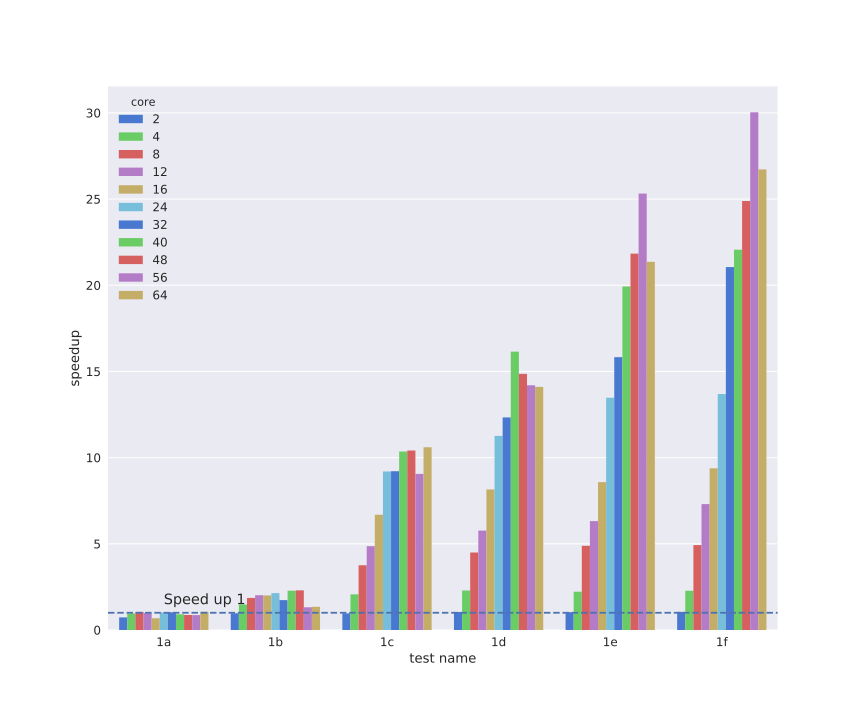
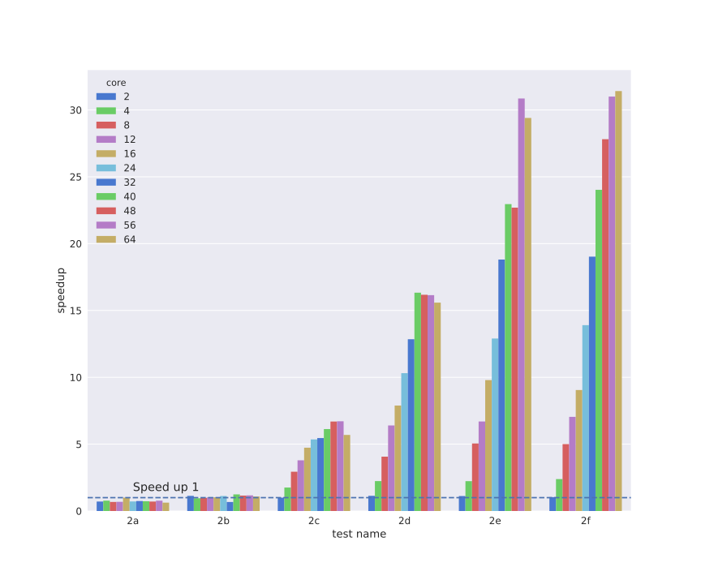
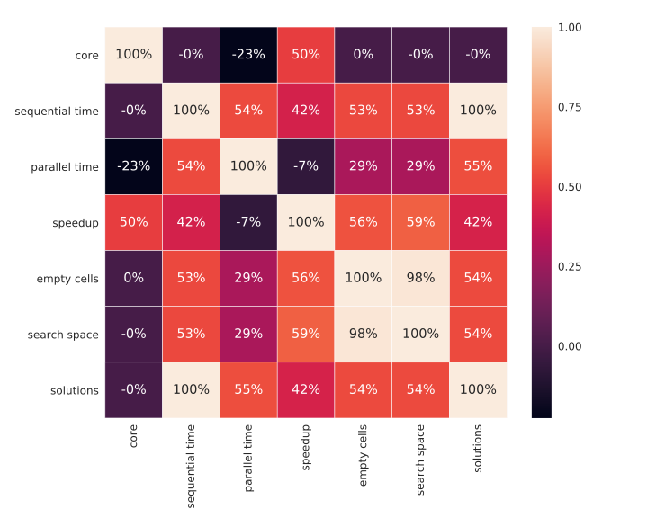
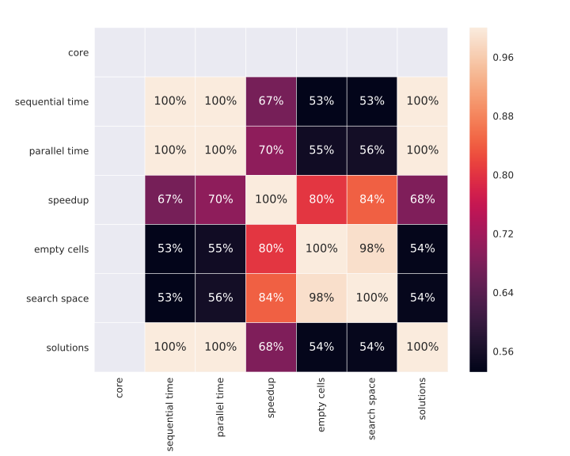

<h1 align="center">
  <b>sudoku-solver</b>
</h1>

<p align="center">
  🔢 Sudoku Solutions Enumerator (Sequential and Parallel)
  <br/>

  <sub>
    Coded by <a href="#authors">Simone Primarosa</a> and <a href="#authors">Q. Matteo Chen</a>.
  </sub>
</p>

## Introduction to Sudoku


Sudoku is a popular puzzle game usually played on a 9x9 board of numbers between
1 and 9.

The goal of the game is to fill the board with numbers. However, each row can
only contain one of each of the numbers between 1 and 9. Similarly, each column
and 3x3 sub-board can only contain one of each of the numbers between 1 and 9.
This makes for an engaging and challenging puzzle game.

A well-formed Sudoku puzzle is one that has a unique solution. A Sudoku puzzle,
more in general, can have more than one solution and our goal is to enumerate
them all, but this task is not always feasible. Indeed, if we were given an
empty Sudoku table, we would have to enumerate
[6670903752021072936960 solutions][ref:sudoku-board-num], and this would take
thousands of years.

### Definitions
In the following sections, we will use some letters or words to refer to
specific aspects of the Sudoku problem. The following table summarizes the most
important.

Term              | Description
------------------|-------------
S                 | A perfect square indicating the number of columns, rows, and boxes of a Sudoku board.
N                 | The total number of cells of a board given as N = S * S.
B                 | The size of a single box of the matrix as B = √S
Board             | An instance of Sudoku represented with a S x S matrix.
Row               | A row of a board's matrix that can only contain one of each of the numbers in [1, S].
Column            | A column of a board's matrix that can only contain one of each of the numbers in [1, S].
Box               | A particular B x B sub-matrix of a board's matrix that can only contain one of each of the numbers in [1, S].
Cell              | A single entry of a board's matrix either empty or with a legal assignment.
Empty Cell        | A cell whose assignment has still to be found.
Cell's Candidates | A list of values in [1, S] which can be legally placed in a particular cell.
Search Space      | The product of the candidates of all the empty cells.
Solution          | An assignment of values for all the empty cells of a board that satisfies the constraints.

## Solving Algorithm
A typical algorithm to solve Sudoku boards is called
[backtracking][ref:backtracking]. This algorithm is essentially a
[depth-first search][ref:dfs] in the tree of all possible guesses in the empty
cells of the Sudoku board.

### Sequential Backtracking
The sequential algorithm, that can be found in
[`src/main/java/sudoku/SequentialSolver.java`][source:sequential], is
implemented iteratively and can be summarized by the following pseudo-code.

```python
def sequential_solutions_counter(board):
  stack = []

  if board.is_full(): return 1
  (row, col) = board.get_empty_cell()
  stack.push((row, col, EMPTY_CELL_VALUE))
  for val in board.get_candidates(row, col): stack.push((row, col, val))

  count = 0
  while len(stack) > 0:
    (row, col, val) = stack.pop()
    board.set_cell(row, col, val)
    if val == EMPTY_CELL_VALUE: continue

    if board.is_full(): count += 1; continue
    (row, col) = board.get_empty_cell()
    stack.push((row, col, 0))
    for val in board.get_candidates(row, col): stack.push((row, col, val))

  return count
```

It's important to notice that the strategy used to pick the empty cell by the
`get_empty_cell` can lead to [significant reduction][ref:look-ahead] of the
total search space and thus in the time needed to enumerate all the solutions.

Another notable thing to consider is that the time complexity and space
complexity of all the operations on the board inside the while loop (`is_full`,
`set_cell`, `get_empty_cell`, `get_candidates`) can significantly impact the
overall performance of the backtracking and thus has to be kept as efficient as
possible.

More details about the computational complexity of the operations and the idea
behind their implementation can be found in the
[implementation details](#implementation-details) section.

### Parallel Backtracking
The parallel algorithm, that can be found in
[`src/main/java/sudoku/ParallelSolver.java`][source:parallel], is
implemented by parallelizing the recursive guesses of each empty cell and can be
summarized by the following pseudo-code.

```python
def parallel_solutions_counter(board, move):
  if move is not null:
    (row, col, val) = move
    board = board.clone()
    board.set_cell(row, col, val)

  if board.is_full(): return 1

  space = board.get_search_space_size()
  if space == 0: return 0
  if space <= SEQUENTIAL_CUTOFF:
    return sequential_solutions_counter(board)

  count = 0
  (row, col) = board.get_empty_cell()
  parallel for val in board.get_candidates(row, col):
    count += parallel_solutions_counter(board, (row, col, val))

  return count
```

The considerations that have been given about the
[sequential backtracking](#sequential-backtracking) also hold for the parallel
version. In addition to those, it's worth mentioning that two new methods have
been introduced (`get_search_space_size` and `clone`).

The presence of those new methods and the creation of a thread for each branch
of the backtracking can further impact performance. The sequential algorithm is
indeed used as sub-routine to speed-up the computation when the remaining search
space is below a certain threshold empirically found.

More details about the computational complexity of the operations and the idea
behind their implementation can be found in the
[implementation details](#implementation-details) section.

## Implementation details
In this section, we discuss the key ideas behind the implementation of the
methods mentioned in the previous sections giving some insights on how we made
them efficient.

### Check if the board is completed
The operation `is_full` consists in knowing whether the board contains at least
an empty cell.

Clearly, a simple approach is to loop through the whole board and check whether
or not there is an empty cell but this would cost `O(N)` each time. Instead of
doing so, we count the number of filled cells of the board (also called clues)
and then compare it against the total number of cells of the board.

At the cost of a constant additional work inside the `set_cell` using this
approach lowers the time complexity of the operation to `O(1)`.

### Check if a value is legal for a cell
The `get_candidates` operation has the job of returning the, possibly empty,
list of valid values which can be legally placed in a particular empty cell.

One approach to accomplish this, is to iterate on the row, column, and box of
the cell given searching for unused values and this would cost us `O(3*S) =
O(S)`. This is almost the best we can aim for this particular operation. Almost,
because we can remove the constant factor `3` by keeping track of the used
values on each row, column, and box of the board.

To do so, we keep a bit-set of `S` bits for each row, column, and box and each
time a specific cell's value `v` is set, we also set the bit at position `v - 1`
of the 3 bit-sets for the particular row, column, and box of the given cell. To
check whether a value `v` is valid or not we just check if the bit at position
`v - 1` is not set in any of the 3 bit-sets for the particular row, column, and
box of the given cell. Since each check is constant and we have `S` to check the
overall time complexity is `O(S)`.

Removing this constant factor leads to some additional constant work inside the
`set_cell` method and an overall additional memory usage of `O(3*S) = O(S)`.

### Count the number of candidates of a cell
The `get_search_space_size` computes the search space as defined in the
[definitions](#definitions) section.

Intuitively, we can do something like the `get_candidates` to count the number
of candidates instead of creating a list and this would cost us `O(N) * O(S) =
O(N * S)`. But a tricky and memory costly approach allows us to reduce the cost
of the operation to just `O(N) * O(1) = O(N)`.

Lets say that for a particular cell we want to count the candidates, the state
of the 3 bit-sets would be the following one.

| value    | 9 | 8 | 7 | 6 | 5 | 4 | 3 | 2 | 1 |
|----------|---|---|---|---|---|---|---|---|---|
| row      | 1 | 0 | 1 | 1 | 0 | 0 | 0 | 0 | 0 |
| column   | 0 | 1 | 0 | 0 | 0 | 0 | 0 | 0 | 0 |
| box      | 0 | 0 | 0 | 0 | 0 | 1 | 1 | 0 | 0 |

If we compute the bitwise or operation of the 3 bit-sets we obtain a new bit-set
that has a 1 on every invalid candidate as showed below.

| value    | 9 | 8 | 7 | 6 | 5 | 4 | 3 | 2 | 1 |
|----------|---|---|---|---|---|---|---|---|---|
| invalid  | 1 | 1 | 1 | 1 | 0 | 1 | 1 | 0 | 0 |

Thus, counting the number of candidates has been reduced to the problem
of counting the zeros of a bit-set.

If we use integers to represent our bit-sets then we could use the integer given
by the binary representation of the bit-set to accesses a pre-computed table
that gives us the answer of how many zeros or ones that particular number has in
constant time. The pre-computed table has to be built only once and can be
shared by all the boards instantiated and requires an implies an additional
memory usage of `O(2^S)`.

### Find an empty cell [TO REWRITE]
One possible strategy we can use for the `get_empty_cell` is simply pick the
first empty cell we find in the board for example from top to bottom, left to
right.

To do so we could just iterate on the board and return that empty cell if
present and this would clearly cost us `O(N)`. Instead of this, we can store the
column of the first empty cell of each row. If we use such data structure and we
also keep track of which is the first row having an empty cell then we can
easily get the empty cell in `O(1)`.

On each set operation we update the next empty cell for the row where the value
has been set and if the row has no more empty cells we update the variable that
tells us which is the first row that contains an empty cell.

So at the cost of an additional work of `O(S)` inside the `set_cell` and an
overall additional memory usage of `O(S)`, we reduced the time complexity for
the `get_empty_cell` method from `O(N)` to `O(1)`.

### Find the empty cell with the lowest number of candidates [TO REWRITE]
As we mentioned in the sections above, the strategy used to pick the empty cell
can impact significantly on the size of the search space. Indeed, the more is
the number of legal candidates for a cell the lower is the probability that our
guess for that cell will result correct.

Thus is intuitively better to always try to guess values for cells that has the
lowest number of candidates.

To do this without affecting the current complexity of the `get_empty_cell`
method we used an array of `S` elements that contains the column index of the
cell with the lowest number of candidates of each row. If we use such additional
array and we also keep track of which is the row that has the cell with the
lower number of candidates then we can easily get the empty cell in constant
time.

To maintain the array update on each set operation we do three things. 1) For
each row try to update the column index of the cell with the lowest number of
candidates with the the column where the value has been set and eventually
update the variable that stores where is the row index of the best empty cel. 2)
For the row where the value has been set try to update the column index with all
the columns of that row and eventually update the variable that stores where is
the row index of the best empty cel. 3) For the rows of the box where the value
has been set try to update the column index with all the columns of that box and
eventually update the variable that stores where is the row index of the best
empty cel.

So at the cost of an additional work of `O(S)` inside the `set_cell` and an
overall additional memory usage of `O(S)`, we have potentially reduced the
search space by many orders of magnitude.

### Optimized addition and multiplication with BigInteger
In Java BigInteger objects are immutable and thus every time an operation is
executed on them a new object is instantiated.

We implemented two modified versions of the BigInteger class, namely `BigIntSum`
and `BigIntProd`, that are mutable BitInteger and allow us to do sums and
products in constant amortized time.

> In general the libs we wrote doesn't execute the operation in constant
amortized time but they do in our particular use case in which we mostly sum and
multiply together small numbers.

### Parallelize branches using the fork/join framework
The Java's Fork/Join framework it's easy to reason with and has convenient
theoretical guarantees.

A so called `RecursiveTask` can model fairly well a backtracking solver. Each
backtracking choice can be tested concurrently forking on each choice.

To minimize the overhead of task creation we employ two common strategies in the
fork/join realm:
- Reusing the same task rather than creating a new fork to simulate the first
choice.
- Choosing a sequential cut-off in a way that the workload of task evenly
distributed.

### Parallelize board copy
The `board` object has to be modified to fill a cell, so each parallel task has
to have its local instance of the board.

Duplicating a board is an expensive operation, so instead of doing it eagerly in
the constructor of the `RecursiveTask`, we only store the change that we want to
try, and we make the copy of the board in its `compute` method that will be
executed in a separate thread.

In this way we offload an expensive computation on the forks, decreasing the
span.

### Choose of the appropriate sequential cut-off
We experimented with different ways to determine the cutoff:
- recursion depth
- still empty cells
- estimated search space

We measured limited differences when choosing one of these parameters, provided
that we optimize the value of the cutoff accordingly.

The correlation graph in section [speedups obtained](#speedups-obtained) readily
explains this result, that is the search space and empty cell have an almost
perfect linear correlation. Thus one can be used to estimate the other.

Concretely the optimal sequential cutoff can be found looking at processor
utilization patterns: it should be full during most of the computation and all
the CPU should complete their task at the same time. The minimum sequential
cutoff also has to consider the task creation overhead.

## Experiments
<!-- Short intro of this section. -->

### Testing environment
To get a scalable and homogeneous environment and reproducible results, we
leveraged the [Google Cloud Infrastructure][ref:gcp].

| os    | core                                    | cpu                            |
|-------|-----------------------------------------|--------------------------------|
| Linux | 2, 4, 8, 12, 16, 24, 32, 40, 48, 56, 64 | Intel(R) Xeon(R) CPU @ 2.30GHz |

### Test cases
To benchmark our implementation we uses a handful of test cases differing mainly
on the number of legal solutions and they can all be found in
[`src/benchmark/boards`][source:bench-boards].

The table that follows summarizes the main characteristics of the tests.

| test name | total cells | empty cells | filling factor | solutions         | search space                         |
|-----------|-------------|-------------|----------------|-------------------|--------------------------------------|
| 1a        | 81          | 53          | 34.57%         | 10^0 * 1.         | 10^25 * 4.312979991503409512448      |
| 1b        | 81          | 59          | 27.16%         | 10^3 * 4.715      | 10^36 * 1.94775186325635072          |
| 1c        | 81          | 61          | 24.69%         | 10^5 * 1.32271    | 10^40 * 1.3980445502865408           |
| 1d        | 81          | 62          | 23.46%         | 10^5 * 5.87264    | 10^41 * 4.7784725839872              |
| 1e        | 81          | 63          | 22.22%         | 10^6 * 3.151964   | 10^43 * 2.3409163772243214336        |
| 1f        | 81          | 64          | 20.99%         | 10^7 * 1.6269895  | 10^45 * 1.1798218541210580025344     |
| 2a        | 81          | 58          | 28.40%         | 10^0 * 1.         | 10^31 * 2.4563768857859261988864     |
| 2b        | 81          | 60          | 25.93%         | 10^2 * 2.76       | 10^35 * 2.617180154844143016738816   |
| 2b        | 81          | 62          | 23.46%         | 10^4 * 3.2128     | 10^39 * 5.54652776685109248          |
| 2d        | 81          | 64          | 20.99%         | 10^6 * 1.014785   | 10^43 * 5.4366191037898352756785152  |
| 2e        | 81          | 65          | 19.75%         | 10^6 * 7.38836    | 10^45 * 4.28133754423449527959683072 |
| 2f        | 81          | 66          | 18.52%         | 10^7 * 4.8794239  | 10^47 * 5.09895408914038847535316992 |

### Execution times
<!-- Table or Graphs showing the execution times of each test. -->
<!-- Which instances does require more time? -->
<!-- Is there a correlation between the fill factor, the search space and execution time? -->

### Speedups obtained
The benchmark reveled a speedup that grows almost linearly in relation to the
number of cores.

The table that follows shows the speedup values grouped by test case and core
count.
<p align="center">
  
  
</p>

Unfortunately due to the overheads introduced in the concurrent algorithm, the
speedup obtained is sometimes slightly smaller than 1. This happens only on
smaller test cases or with a very low number of cores.

To understand the root cause of the values obtained, we computed a correlation
matrix over all the data we gathered.

While the sequential time depends linearly on the number of solution and
unrelated to the number of cores, the factors that make up the parallel time and
the speed up are more varied.

The correlation matrix is muddled by the core count, thus we plotted several
correlation matrices grouping the data by core count. On the right there is an
example of the correlation matrix for the test data obtained on the 64 core
machine.
<p align="center">
  
  
</p>

We can see clearly that the speedup is correlated greatly with the search space
and the empty cells, rather than only with the number of solutions. This is
expected because search space and empty cells are almost linearly dependent and
search space determines how much branching we can have on our parallel solver.

This trend can also be found looking at the speed-up plot.

The speedup also is not very strongly correlated with the number of solutions,
while the parallel time is linearly dependent of the number of solutions.

We can conclude speedup comes from being able to explore the whole search space
faster and could be improved a little tweaking the ForkJoin parameters.

## Usage


The project is provided with a [CLI][bin:run-cli] that allows you
to run the solver on your machine with ease.

If you want to run it locally, you need to run the following commands.
```bash
git clone https://github.com/simonepri/sudoku-solver.git
cd sudoku-solver

./sudoku
```

> NB: This will also trigger the build process so be sure to have the
[Java JDK][download:jjdk] installed on your machine prior to launch it.

## Benchmarking suite


The project is provided with a [CLI][bin:bench-cli] that allows you
to reproduce the tests results on your machine.

If you want to run it locally, you need to run the following commands.
```bash
git clone https://github.com/simonepri/sudoku-solver.git
cd sudoku-solver

./bench
```

> NB: This will also trigger the build process so be sure to have the
[`Java JDK`][download:jjdk] installed on your machine prior to launch it.

> TIP: You can stop a test by hitting `CTRL+C` or `Command+C`.

## Development
Clone the repository to your local machine then cd into the directory created by
the cloning operation.

```bash
git clone https://github.com/simonepri/sudoku-solver.git
cd sudoku-solver
```

The source code for the sudoku solver can be found in
[`src/main/java/sudoku`][source:main], while the source code for the unit tests
and the benchmarking suite can be found in [`src/test/java/sudoku`][source:test]
and [`src/benchmark`][source:benchmark] respectively.

Build the project, run the unit tests and run the CLI.
```bash
# On Linux and Darwin
./gradlew build
./gradlew test
./gradlew run

# On Windows
./gradlew.bat build
./gradlew.bat test
./gradlew.bat run
```

> NB: You will need the [`Java JDK`][download:jjdk] installed on your machine to
build the project.

## Authors
- **Simone Primarosa** - *Github* ([@simonepri][github:simonepri]) • *Twitter* ([@simoneprimarosa][twitter:simoneprimarosa])
- **Q. Matteo Chen** - *Github* ([@chq-matteo][github:chq-matteo]) • *Twitter* ([@chqmatteo][twitter:chqmatteo])

## License
This project is licensed under the MIT License - see the [license][license] file for details.

<!-- Links -->
[license]: https://github.com/simonepri/sudoku-solver/tree/master/license
[source]: https://github.com/simonepri/sudoku-solver/tree/master/src/main/java/sudoku
[bin:bench-cli]: https://github.com/simonepri/sudoku-solver/tree/master/bench
[bin:run-cli]: https://github.com/simonepri/sudoku-solver/tree/master/sudoku

[source:main]: https://github.com/simonepri/sudoku-solver/tree/master/src/main/java/sudoku
[source:test]: https://github.com/simonepri/sudoku-solver/tree/master/src/test/java/sudoku
[source:benchmark]: https://github.com/simonepri/sudoku-solver/tree/master/src/benchmark
[source:sequential]: https://github.com/simonepri/sudoku-solver/tree/master/src/main/java/sudoku/SequentialSolver.java
[source:parallel]: https://github.com/simonepri/sudoku-solver/tree/master/src/main/java/sudoku/ParallelSolver.java
[source:bench-boards]: https://github.com/simonepri/sudoku-solver/tree/master/src/benchmark/boards

[github:simonepri]: https://github.com/simonepri
[twitter:simoneprimarosa]: http://twitter.com/intent/user?screen_name=simoneprimarosa
[github:chq-matteo]: https://github.com/chq-matteo
[twitter:chqmatteo]: http://twitter.com/intent/user?screen_name=chqmatteo

[download:git]: https://git-scm.com/downloads
[download:jjdk]: https://www.oracle.com/technetwork/pt/java/javase/downloads/index.html

[ref:sudoku-board-num]: http://www.afjarvis.staff.shef.ac.uk/sudoku
[ref:backtracking]: https://en.wikipedia.org/wiki/backtracking
[ref:dfs]: https://en.wikipedia.org/wiki/depth-first_search
[ref:look-ahead]: https://en.wikipedia.org/wiki/look-ahead_(backtracking)
[ref:gcp]: https://cloud.google.com/compute/docs/machine-types#highcpu
