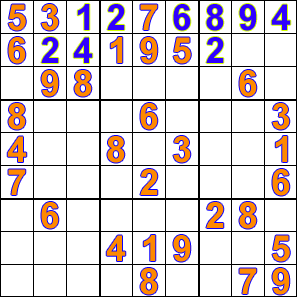

<h1 align="center">
  <b>sudoku-solver</b>
</h1>

<p align="center">
  🔢 Sudoku Solutions Enumerator (Sequential and Parallel)
  <br/>

  <sub>
    Coded by <a href="#authors">Simone Primarosa</a> and <a href="#authors">Q. Matteo Chen</a>.
  </sub>
</p>

## Introduction to Sudoku


Sudoku is a popular puzzle game usually played on a 9x9 board of numbers between
1 and 9.

The goal of the game is to fill the board with numbers. However, each row can
only contain one of each of the numbers between 1 and 9. Similarly, each column
and 3x3 sub-board can only contain one of each of the numbers between 1 and 9.
This makes for an engaging and challenging puzzle game.

A well-formed Sudoku puzzle is one that has a unique solution.
A Sudoku puzzle, more in general, can have more than one solution and our goal
is to enumerate them all, but this task is not always feasible.
Indeed, if we were given an empty Sudoku table we would have to enumerate
[6670903752021072936960 solutions][ref:sudoku-board-num] and this would take thousands of
years.

## Solving Algorithm
A common algorithm to solve Sudoku boards is called backtracking. This algorithm
is essentially a depth first search in the tree of all possible guesses in the
empty cells of the Sudoku board.

### Sequential Backtracking
TODO

### Parallel Backtracking
TODO

## Results
TODO

## Usage
The project is provided with a [CLI][bin:run-cli] that allows you
to run the solver on your machine with ease.

If you want to run it locally, you need to run the following commands.
```bash
git clone https://github.com/simonepri/sudoku-solver.git
cd sudoku-solver

./sudoku
```

> NB: This will also trigger the build process so be sure to have the
[Java JDK][download:jjdk] installed on your machine prior to launch it.


## Benchmarking suite
The project is provided with a [CLI][bin:bench-cli] that allows you
to reproduce the tests results on your machine.

If you want to run it locally, you need to run the following commands.
```bash
git clone https://github.com/simonepri/sudoku-solver.git
cd sudoku-solver

./bench
```

> NB: This will also trigger the build process so be sure to have the
[`Java JDK`][download:jjdk] installed on your machine prior to launch it.


> TIP: You can stop a test by hitting `CTRL+C` or `Command+C`.

## Development
Clone the repository to your local machine then cd into the directory created by
the cloning operation.

```bash
git clone https://github.com/simonepri/sudoku-solver.git
cd sudoku-solver
```

The source code for the sudoku solver can be found in
[`src/main/java/sudoku`][source:main], while the source code for the unit tests
and the benchmarking suite can be found in [`src/test/java/sudoku`][source:test]
and [`src/benchmark`][source:benchmark] respectively.

Build the project, run the unit tests and run the cli.
```bash
# On Linux and Darwin
./gradlew build
./gradlew test
./gradlew run

# On Windows
./gradlew.bat build
./gradlew.bat test
./gradlew.bat run
```

> NB: You will need the [`Java JDK`][download:jjdk] installed on your machine to
build the project.

## Authors
- **Simone Primarosa** - *Github* ([@simonepri][github:simonepri]) • *Twitter* ([@simoneprimarosa][twitter:simoneprimarosa])
- **Q. Matteo Chen** - *Github* ([@chq-matteo][github:chq-matteo]) • *Twitter* ([@chqmatteo][twitter:chqmatteo])

## License
This project is licensed under the MIT License - see the [license][license] file for details.

<!-- Links -->
[license]: https://github.com/simonepri/sudoku-solver/tree/master/license
[source]: https://github.com/simonepri/sudoku-solver/tree/master/src/main/java/sudoku
[bin:bench-cli]: https://github.com/simonepri/sudoku-solver/tree/master/bench
[bin:run-cli]: https://github.com/simonepri/sudoku-solver/tree/master/sudoku

[source:main]: https://github.com/simonepri/sudoku-solver/tree/master/src/main/java/sudoku
[source:test]: https://github.com/simonepri/sudoku-solver/tree/master/src/test/java/sudoku
[source:benchmark]: https://github.com/simonepri/sudoku-solver/tree/master/src/benchmark

[github:simonepri]: https://github.com/simonepri
[twitter:simoneprimarosa]: http://twitter.com/intent/user?screen_name=simoneprimarosa
[github:chq-matteo]: https://github.com/chq-matteo
[twitter:chqmatteo]: http://twitter.com/intent/user?screen_name=chqmatteo

[download:git]: https://git-scm.com/downloads
[download:jjdk]: https://www.oracle.com/technetwork/pt/java/javase/downloads/index.html

[ref:sudoku-board-num]: http://www.afjarvis.staff.shef.ac.uk/sudoku
